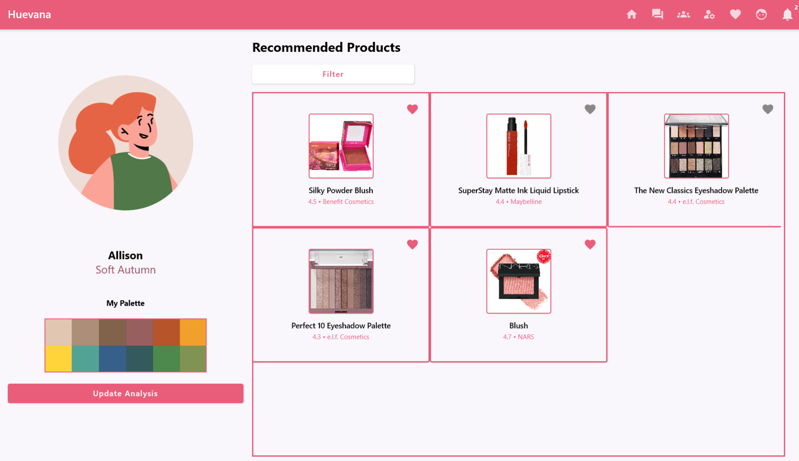
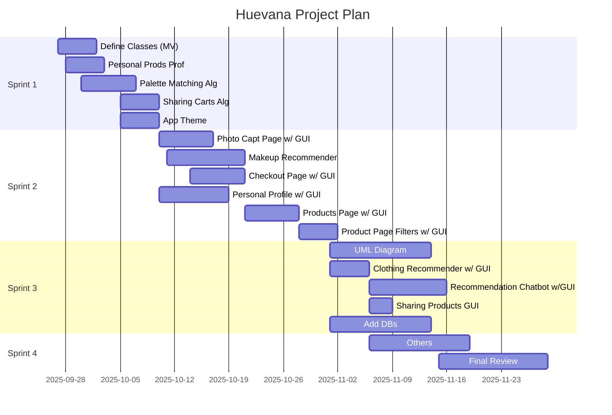

## 1. Description
Huevana

A personal colour analysis application that maps a person's skintone (using hexcodes) to a specific colour palette that best suits them. 

Team 101-02

Krupa Prajapati - k6prajap@uwaterloo.ca

Allison Kempton - arkempto@uwaterloo.ca

Vinita Kallam - vkallam@uwaterloo.ca

Shraddha Mishra - s5mishra@uwaterloo.ca

Youtube Video Link:
https://youtu.be/cx3rzdvaU4k

Acknowledgements:
https://git.uwaterloo.ca/s5mishra/appdevproject/-/wikis/Acknowledgements

Releases:

https://git.uwaterloo.ca/s5mishra/appdevproject/-/wikis/Version-1.0-Release

## 2. Project Information

https://git.uwaterloo.ca/s5mishra/appdevproject/-/wikis/Team-Contract

https://git.uwaterloo.ca/s5mishra/appdevproject/-/wikis/Proposal

https://git.uwaterloo.ca/s5mishra/appdevproject/-/wikis/Meeting-Minutes

https://git.uwaterloo.ca/s5mishra/appdevproject/-/wikis/Developer-Logs

https://git.uwaterloo.ca/s5mishra/appdevproject/-/wikis/Team-Reflections

## 3. User Guide

https://git.uwaterloo.ca/s5mishra/appdevproject/-/wikis/Getting-Started

https://git.uwaterloo.ca/s5mishra/appdevproject/-/wikis/User-Guide

## 4. Design Documents

https://git.uwaterloo.ca/s5mishra/appdevproject/-/wikis/ERD-Diagram

https://git.uwaterloo.ca/s5mishra/appdevproject/-/wikis/Class-Diagrams

## 5. Grading Instructions

Make sure you have a working network connection (not HotSpot) when using the app.
Also make sure you don't have any unnecessary Firewall Restrictions as it won't connect to Supabase.

Project Plan from before:

